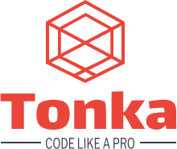

# TONKA, A TRUE PHP FRAMEWORK

> Lightweight, Fast Coding and Secure!

Tonka is a PHP Framework based on the MVC model (Model View Controller), fast, lightweight and full of features to make the development experience more exciting and brighter.

[Github Repo](https://github.com/clicalmani/Tonka)
[Getting Started](./introduction.md)
